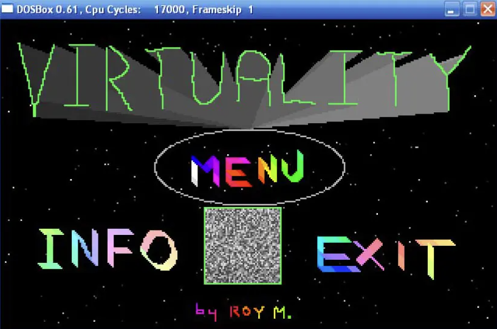

# Virtuality

Virtuality is a preserved QBasic/MS-DOS graphics demo from the mid-1990s, rebuilt as a modern browser catalog and a downloadable macOS screen saver.

Original code: Roy Massaad  
Approximate year: 1996  
Original platform: QBasic / QuickBASIC 4.5, VGA 320x200



## About

The original program is a collection of small animation experiments: screen saver-style patterns, demo scene effects, palette tricks, tunnels, lasers, particles, and other VGA-era sketches. It was written on 486-era hardware and kept here as both an archive and a remastering project.

The repository contains:

- The original DOS/QBasic source and data files.
- A browser remaster built with React, TypeScript, Vite, and canvas.
- A macOS `.saver` host that packages the browser remaster as a native screen saver.
- Notes for a future Windows screen saver build.

Historical files such as `README.TXT`, `README.BAS`, and `VIRT.BAS` are intentionally preserved in their original style.

## Run The Browser Remaster

```sh
npm install
npm run dev
```

Build the Netlify/static site:

```sh
npm run build
```

Netlify publishes the generated `dist/` directory. Static downloads live under `public/` and are copied into `dist/` by Vite.

## Downloadable macOS Screen Saver

The landing page includes a macOS screen saver download:

```text
/downloads/Virtuality-macOS-screensaver.zip
```

That zip contains `Virtuality.saver`. To install it:

1. Download and unzip `Virtuality-macOS-screensaver.zip`.
2. Double-click `Virtuality.saver`.
3. Accept the macOS install prompt.
4. Open System Settings -> Screen Saver.
5. Select Virtuality.
6. Use Options to choose the scene, render mode, and scene parameters.
7. Use Preview to test it.

If Options does not open immediately after the first install, close System Settings and open Screen Saver again. On current macOS releases, the installer-opened Settings window can show the Options button before it is ready to dispatch the configure-sheet request.

## Build The macOS Screen Saver Locally

```sh
npm install
npm run build
platform/macos/build.sh
```

The local build is written to:

```text
build/macos/Virtuality.saver
```

For detailed macOS build, install, and signing notes, see [platform/macos/README.md](platform/macos/README.md). For broader screen saver packaging notes, see [docs/screensaver.md](docs/screensaver.md).

## Original DOS Version

The original program can be run in a DOS/QBasic environment. Use the arrow keys to navigate the main menu, Space or Enter to select, number keys for shortcuts, and Escape to exit.

The original code is intentionally simple and period-specific:

- It uses QBasic drawing commands rather than direct video memory access.
- It clears and redraws the screen often, so frame pacing varies.
- It relies on external `DATA*` files for some effects.
- It was tuned around a 486 DX2/DX4-era machine, so speed differs by emulator or hardware.

## License

See [LICENSE](LICENSE).
